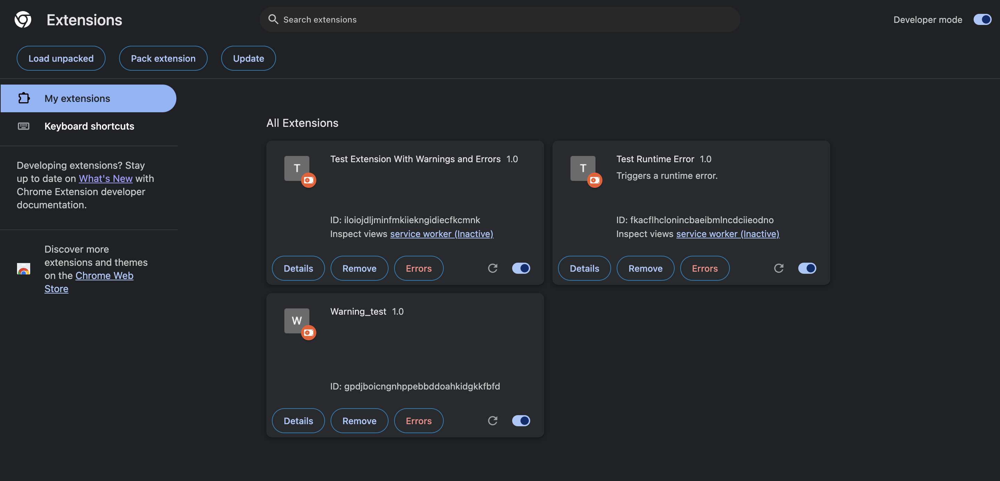
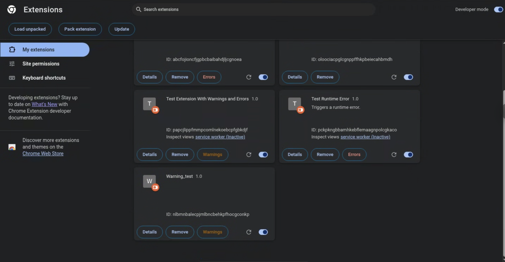
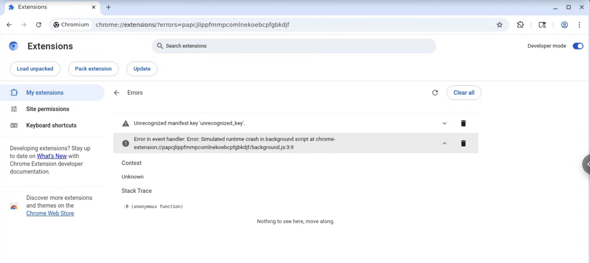
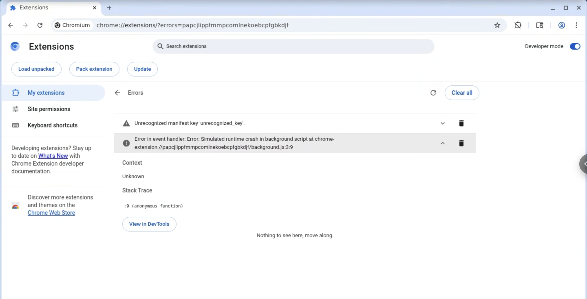

[](#) &nbsp;[](#)  
Google Summer of Code 2025 for Rocket.Chat

# 🚀 Chrome Extension APIs
Hello, this is Amit! I created this repository as a dedicated hub for my final work product submission, which illustrates and highlights my contributions to Chromium during Google Summer of Code - 2025. 

## 🛠️ Project Overview  
The goal: **Improve the Chrome Extensions developer experience** by enhancing debugging tools, APIs, and extension workflows.  

Main focus areas:  
- Improvements to **`chrome://extensions`** page (the hub where developers manage/debug their extensions).  
- New/Improved **Extension APIs** (aligning with WECG standards).  
- Better **debugging experience** for Manifest V3 extensions.  

---

## 🔨 My Contributions  

### 1. Extensions Page – Better Error Visibility  
- **Before:** Always showed “Errors” → confusing when only warnings existed.  
- **After:** Now shows **“Warnings”** when appropriate.  
- Helps developers quickly distinguish between errors and warnings.  

📸 *UI Update:*  
<table>
  <tr>
    <td align="center"><b>Before</b></td>
    <td align="center"><b>After</b></td>
  </tr>
  <tr>
    <td></td>
    <td></td>
  </tr>
</table>

🔗 [Code Change](https://chromium-review.googlesource.com/c/chromium/src/+/6639214)  

---

### 2. ✅ Debugging Made Easier – *View in DevTools* Button  
- Added a **button in the extension error page** to open the **right DevTools target directly**.  
- No more manually finding the right SW or background page!  

📸 *UI Update:*  
<table>
  <tr>
    <td align="center"><b>Before</b></td>
    <td align="center"><b>After</b></td>
  </tr>
  <tr>
    <td></td>
    <td></td>
  </tr>
</table>

🔗 [Code Change](https://chromium-review.googlesource.com/c/chromium/src/+/6702715)  

---

### 3. ✅ RuntimeError Enhancements  
- Added:  
  - `isServiceWorker` → flags if error belongs to a Service Worker.  
  - `canInspect` → allows DevTools inspection if error is from a SW.  
- Enables correct DevTools target selection (even for **inactive SWs**).  

🔗 [Code Change](https://chromium-review.googlesource.com/c/chromium/src/+/6830747)  

---

### 4. ⚙️ New API: `getSystemUILanguage()` *(WIP)*  
- Returns OS language as **BCP 47 tag** (`en-US`, `fr-FR`, etc.).  
- Special handling for `C`/`POSIX` → maps to `en-US`.  
- Cross-platform support: **Windows, macOS, Linux**.  
- Added **comprehensive test coverage**.  

🔗 [Code Change](https://chromium-review.googlesource.com/c/chromium/src/+/6790185)  

---

### 5. ⚙️ Alarms API – Persistence Across Sessions *(WIP)*  
- Added **`persistAcrossSessions` flag** in `chrome.alarms.create`.  
- Default: `true` → alarms survive browser restarts.  
- Session-only alarms vanish after restart.  

📸 *Example Flow:*  
```js
chrome.alarms.create("dailyCheck", { delayInMinutes: 5, persistAcrossSessions: true });
```


## 📌 A quick recapse of My GSoC Journey  
- I contributed to the **Chromium codebase** for GSoC’25 under the Chrome Extensions team.  
- This experience gave me **deep insights into browser internals**, API design, and large-scale C++/JavaScript codebases.  
- I learned how real-world browser features are developed, tested, reviewed, and shipped.  
- Working with mentors and the community helped me **gain confidence in open-source collaboration**.  

